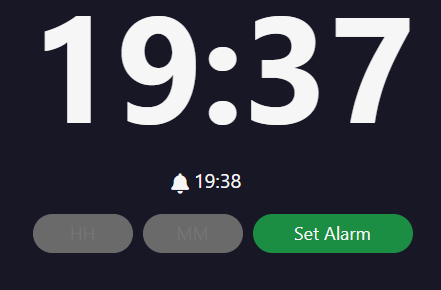

## Alarm Clock Project

This project is a simple, functional digital alarm clock built using HTML, CSS, and JavaScript. It displays the current time and allows the user to set an alarm. When the alarm time is reached, an audio alert plays.

  

### Features

*   **Real-time Clock Display:** Shows the current time in HH:MM format, updating every second.
*   **Alarm Setting:**  Users can input an alarm time using two input fields, one for hours (HH) and one for minutes (MM).
*   **Input Validation:**
    *   Only numeric input is allowed in the hour and minute fields.
    *   Input is limited to two digits.
    *   Hours are validated to be between 0 and 23.
    *   Minutes are validated to be between 0 and 59.
    *   Error messages are displayed to the user if the input is invalid.
*   **Alarm Trigger:** When the current time matches the set alarm time, an alarm sound plays.
*   **Visual Alert:**  The clock display changes color (to green) when the alarm is triggered, and reverts to the original color after the alarm sound finishes.
*   **Alarm Display:** The currently set alarm time is displayed above the input fields.
*   **Automatic Next-Day Alarm:** If the user sets an alarm for a time that has already passed in the current day, the alarm is automatically scheduled for the same time on the following day.
*   **Responsive Design:**  The layout adapts to different screen sizes, making it usable on desktops, tablets, and mobile devices.

### Technologies Used

*   **HTML5:**  Structure of the webpage, including input fields, display areas, and the form.
*   **CSS3:** Styling of the clock, alarm display, input fields, and error messages.  Handles the responsive layout.
*   **JavaScript:**  Handles the clock logic, alarm setting, input validation, alarm triggering, and audio playback.
*   **Font Awesome:** Used for the bell icon.
*  **Reset CSS** - This is used to reset the default browser styling.

### Potential Improvements

*   **AM/PM Option:** Add an option to set the alarm in 12-hour format (AM/PM).
*   **Snooze Functionality:** Implement a snooze button to temporarily silence the alarm.
*   **Multiple Alarms:** Allow users to set and manage multiple alarms.
*   **Alarm Sound Selection:**  Provide options for users to choose different alarm sounds.
*   **Persistent Storage:** Use `localStorage` or `sessionStorage` to save the alarm time even if the page is refreshed.
*   **Accessibility:** Improve accessibility by adding ARIA attributes and ensuring proper keyboard navigation.